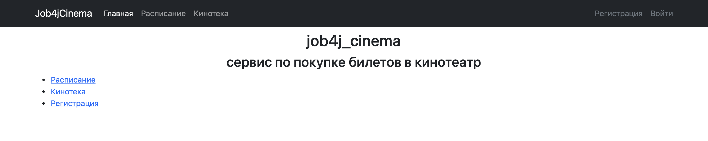
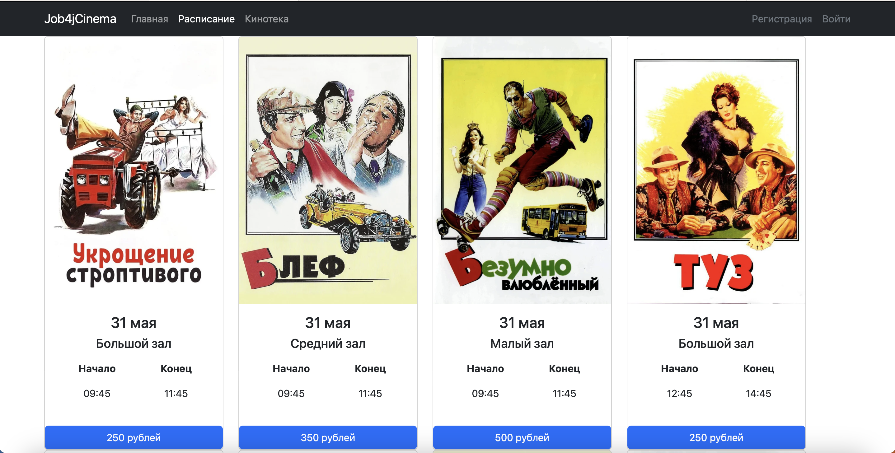
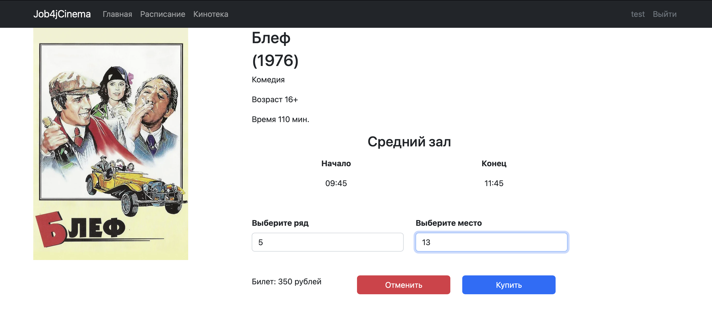
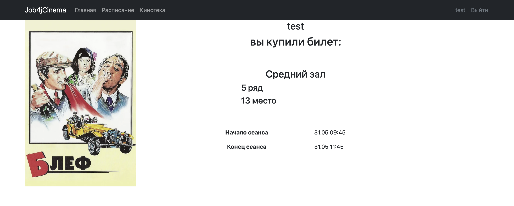
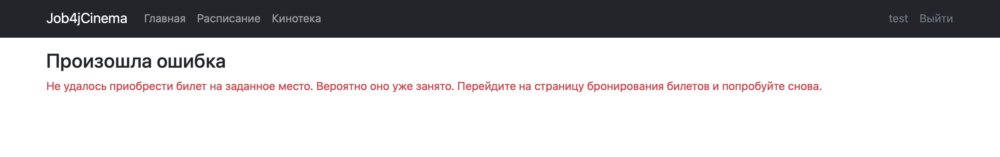
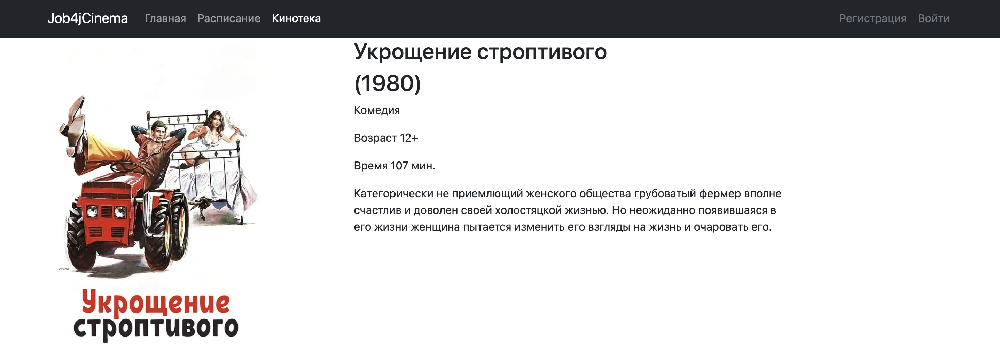
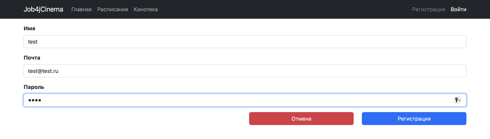
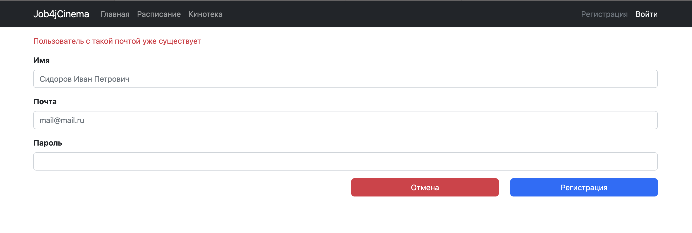
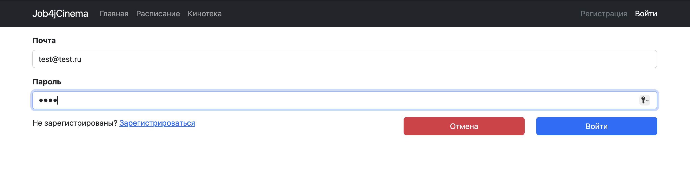

# job4j_cinema

## О проекте

Сервис по покупке билетов в кинотеатр

### Навигационная панель:

1. **Лого** </br> При клике на него выполняется переход на главную страницу;
2. **Расписание** </br> Выводятся сеансы и связанные с ними фильмы;
3. **Кинотека** </br> Выводится список фильмов, которые показываются в кинотеатре;
4. **Регистрация/Вход** </br> Если пользователь не вошел в систему;
5. **Имя пользователя/Выйти** </br> Если пользователь вошел в систему.

### Разделение прав:

Все пользователи имеют право просматривать информацию на сайте. <br/>
Только зарегистрированные пользователю могут покупать билеты. <br/>
Если пользователь не зарегистрирован и нажимает на кнопку "Купить", <br/>
то его перебрасывает на страницу входа.

## Для реализации проекта используются:

+ **Java 17**
+ **Spring Boot 2.7.6**
+ **HTML 5**
+ **Thymeleaf 3.0.15**
+ **Bootstrap 5.2.3**
+ **Postgresql 14**
+ **Liquibase 4.15.0**
+ **H2 2.1.214**
+ **Sql2o 1.6.0**
+ **Junit5**
+ **Mockito 3.5.13**

## Требования к окружению

+ **Java 17**
+ **Maven 3.8.7**
+ **Postgresql 14**

## Запуск проекта

+ **Скачать проект**
</br><https://github.com/antonglavatskiy/job4j_cinema/archive/refs/heads/main.zip/>
+ **Создать базу данных cinema**
``` shell 
create database cinema;
```
+ **Выполнить скрипты 001 - 012 из директории:**
</br>*job4j_cinema-main/db/scripts*
+ **В терминале перейти в проект**
+ **Запустить проект**
``` shell 
mvn spring-boot:run
```

## Взаимодействие с приложением:

Главная страница. Общая информация о ресурсе


Расписание. Страница с расписанием сеансов, пользователь выбирает сеанс


Сеанс. Страница с описанием сеанса и выбора места в зале


Билет. Только зарегистрированный пользователь может купить билет


Билет. Страница ошибки покупки. Место уже куплено


Кинотека. Страница с описанием фильмов


Регистрация. Страница регистрации пользователя


Регистрация. Ошибка регистрации пользователя


Вход. Страница входа в сервис


## Контакты

+ <a href="https://t.me/GlaAnton">Telegram</a>

***

